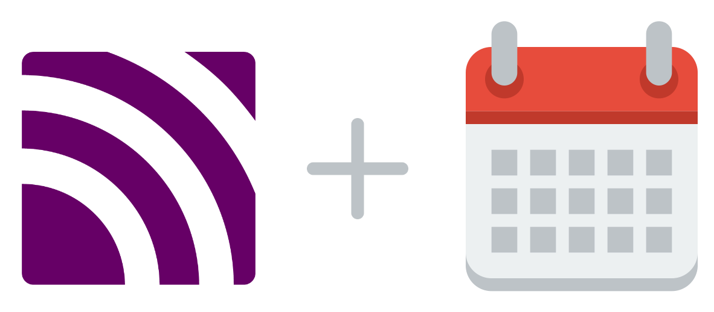

  

# mqtt2caldav  
This project reads MQTT events and creates predefined CALDAV events.  
<br />
<br />


## Licence 
mqtt2caldav is licensed under the [GNU GENERAL PUBLIC LICENSE Version 3](https://github.com/107208579/mqtt2caldav/blob/main/LICENSE.gpl).
<br />
<br />
<br />


## Requirements  
* MQTT Server Connection
* CALDAV Server Connection
* [paho-mqtt](https://pypi.org/project/paho-mqtt/)
* [caldav](https://pypi.org/project/caldav/)
<br />
<br />


## Configuration  
The configuration file is located under `config/config.json` and holds some sample data. 
<br />
<br />


**MQTT :: Connection**  
Specifies the MQTT server connection.
```
"MQTT_SERVER_ADDRESS": "localhost",
"MQTT_SERVER_PORT": "1883",
"MQTT_USERNAME": "username",
"MQTT_PASSWORD": "password"
 ```
<br />
<br />


**CALDAV :: Connection**  
Specifies the CALDAV server connection.
```
"CALDAV_SERVER_ADDRESS": "https://server.com/remote.php/dav/calendars/user",
"CALDAV_USERNAME": "username",
"CALDAV_PASSWORD": "password"
 ```
<br />
<br />


**MQTT :: Trigger**   
Specifies the MQTT topic and MQTT event string to trigger a calendar event creation.
```
"MQTT_TOPIC": "mqtt/Main_Switch",
"MQTT_EVENT": {"action":"on"},
```
<br />
<br />


**EVENT :: Calendar**  
Specifies the calendar location in which a calendar event is created.
```
"EVENT_CALENDAR"
```
* "localhost/dav/calendar/work"
* "http:<span></span>//server.com/remote.php/dav/calendars/user/home"
* ...
<br />
<br />


**EVENT :: Summary**  
Specifies the event title.
```
"EVENT_SUMMARY"
```
* "Meeting"
* "Buy More Milk"
* "Procrastination"
* ...
<br />
<br />


**EVENT :: Location**  
Specifies the event location. Use a double backslash to escape a comma.
```
"EVENT_LOCATION"
```
* "Home"
* "Annwn Regio"
* "1 Street\\, 23456 City\\, Country"
* ...
<br />
<br />


**EVENT :: Geo**  
Specifies the event location in latitude and longitude GPS coordinates.
```
"EVENT_GEO"
```
* "41.726931;-49.948253"
* "1.2489458;103.8343056"
* "-73.0499998;-13.416665"
* ...
<br />
<br />


**EVENT :: Categories**  
Specifies the category/categories for a calendar event. This field is commonly used for 'Tags' in various calendar apps.
```
"EVENT_CATEGORIES"
```
* "Visit"
* "Meeting"
* "Beachy Beach\\, Sandy Sand\\, Sunny Sun"
* ...
<br />
<br />


**EVENT :: URL**  
Specifies a Uniform Resource Locator (URL) associated with a calendar event.
```
"EVENT_URL"
```
* "http:<span></span>//something.com"
* "http:<span></span>//buymoremilk.com"
* "http:<span></span>//eatmorechicken.com"
* ...
<br />
<br />


**EVENT :: Description**  
Specifies the description for a calendar event.
```
"EVENT_DESCRIPTION"
```
* "Meeting with Homer"
* "Take over the world!"
* "Dont forget to buy fresh milk!"
* ...
<br />
<br />


**EVENT :: Transparency**  
Specifies if a calendar event is listed as busy or free.
```
"EVENT_TRANSP"
```
* "OPAQUE" → Busy
* "TRANSPARENT" → Free 
<br />
<br />


**EVENT :: Time Zone**  
Specifies the timezone in which a calendar event is created. List of tz timezones→ https://<span></span>en.wikipedia.org/wiki/List_of_tz_database_time_zones
```
"EVENT_TIMEZONE"
```
* "Etc/GMT+12"
* "Europe/London"
* "Asia/Singapore"
* ...
<br />
<br />
 
 
**EVENT :: Trigger**  
Specifies a calendar event alarm.
```
"EVENT_TRIGGER"
```
* "" → No alert will be set or configured  
* "0" → Alert will trigger at event start time
* "15" → Alert will trigger 15 minutes before event start time
* ...
<br />
<br />


**EVENT :: Seconds**  
Specifies if a calendar event start time and calendar event end time will have seconds set.
```
"EVENT_SECONDS"
```
* "True" → 12:34:56  
* "False" → 12:34:00   
<br />
<br />


**EVENT :: Rounding**  
Specifies if a calendar event start time has minutes rounded up or down to the closest defined value.
```
"EVENT_ROUNDING"
```
* "1" → 12:42:29 rounds to 12:42:00 and 12:42:30 rounds to 12:43:00
* "5" → 12:42:29 rounds to 12:40:00 and 12:42:30 rounds to 12:45:00 
* "30" → 12:42:29 rounds to 12:30:00 and 12:42:30 rounds to 13:00:00
* ...
<br />
<br />


**EVENT :: Duration**  
Specifies a calendar event duration in minutes.
```
"EVENT_DURATION"
```
* "1" → If event start time is 12:34:00, event end time will be set to 12:35:00
* "10" → If event start time is 12:34:00, event end time will be set to 12:44:00
* "120" → If event start time is 12:34:00, event end time will be set to 14:34:00
* ...
<br />
<br />


## Log File  
The log file is located under `logs/mqtt2caldav.log`. 
<br />
<br />
